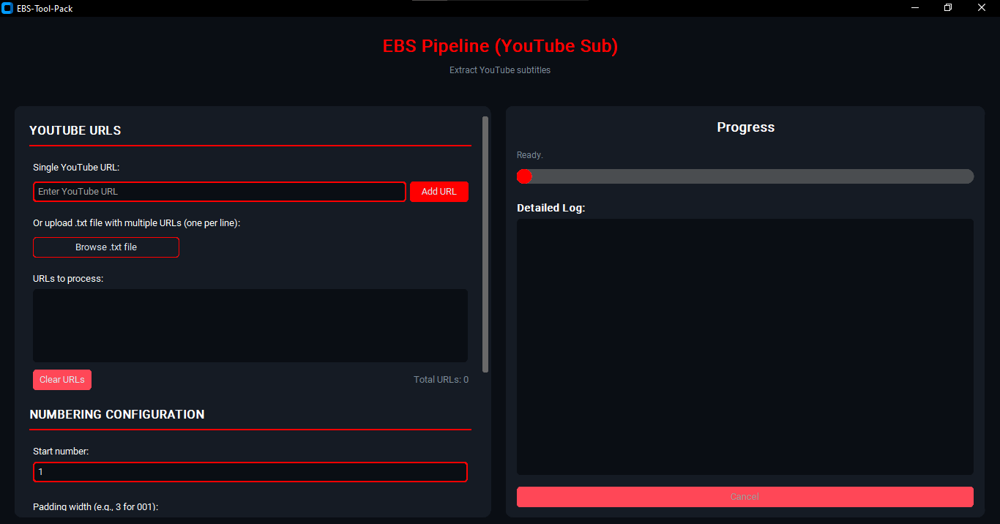

# EBS-Tool-Pack: YouTube Subtitle Extractor GUI

**EBS-Tool-Pack** is a graphical application designed to extract English subtitles from YouTube videos using `yt-dlp`. It provides a user-friendly interface for entering one or more YouTube URLs and saving the extracted subtitles as sequentially numbered `.txt` files.



---

##  Features

- Extracts both **manual** and **automatic** English subtitles.
- Accepts single URL input or batch processing via `.txt` file.
- Automatically numbers output files (with optional padding).
- Merges new results with previously saved ones (`youtube_results.json`).
- Built-in progress tracking, logging, and error reporting.
- Customizable output directory.
- Dark-themed GUI built using `CustomTkinter`.

---

##  Requirements

- Python 3.8+
- [yt-dlp](https://github.com/yt-dlp/yt-dlp)
- [customtkinter](https://github.com/TomSchimansky/CustomTkinter)
- [certifi](https://pypi.org/project/certifi/)

You can install the required packages with:

```bash
pip install yt-dlp customtkinter certifi
````

---

##  How to Use

1. **Run the script**:

   ```bash
   python ebs_pipeline_gui.py
   ```

2. **Input YouTube URLs**:

   * Paste a single URL or upload a `.txt` file containing multiple URLs (one per line).

3. **Configure numbering**:

   * Choose the starting number and padding width (e.g., `3` for `001.txt`).

4. **Set output folder** *(optional)*:

   * Leave blank to auto-create `./Downloaded-Sub/`.

5. **Start extraction**:

   * Click **"Start Extraction"** and the tool will process each video.

6. **Output**:

   * Subtitles will be saved as `.txt` files, numbered sequentially.
   * A JSON index of results is maintained (`youtube_results.json`).

---

## 📝 Notes

* The tool prioritizes manual English subtitles and falls back to auto-generated captions.
* If a video doesn't have subtitles, an error file is generated with the reason.
* The app includes caching to avoid redundant downloads of previously processed videos.

---

## 📂 Output Example

```bash
Downloaded-Sub/
├── 001.txt
├── 002.txt
├── ...
```

Each file contains clean, readable subtitle content.

---

## 🛠 Developer Info

Main entry point: `ebs_pipeline_gui.py`

GUI framework: [CustomTkinter](https://github.com/TomSchimansky/CustomTkinter)

Subtitle logic uses `yt-dlp` to fetch video metadata and subtitle URLs, and parses subtitle data from various formats including JSON and VTT.


---

## 📄 License

MIT License


